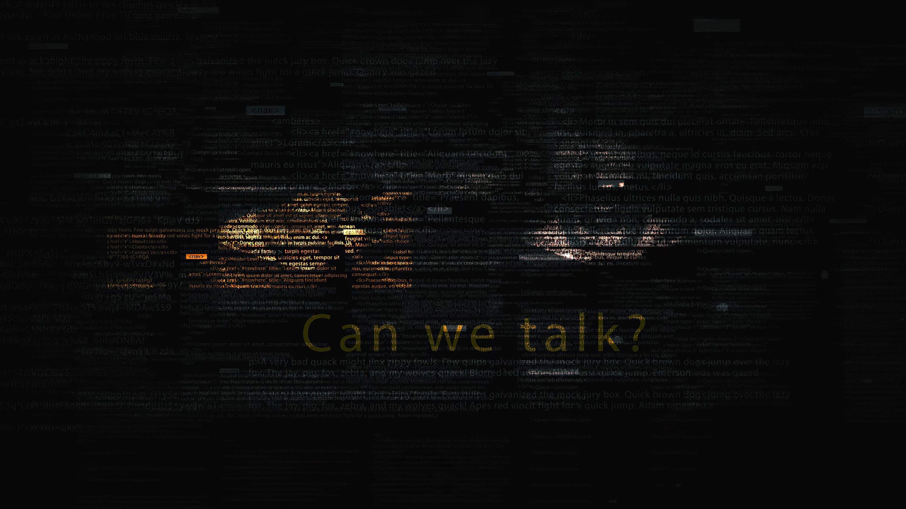
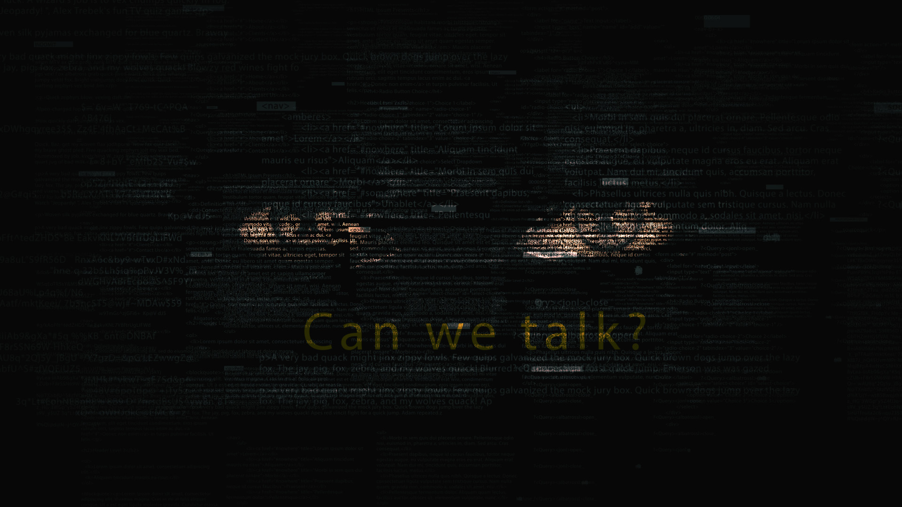

# Barclays

- Source URL: https://www.jamesharford.com/barclays
- Slug: barclays

## Vice x AI Machine Learning

**Role/Credit:** Concept, Design, Direction, Animation

Beej was contacted by Vice - The main task was to create a visual representation of what an internet hacker hacker would look like, real of not... AI or human - the silent enemy of the internet prowling in the hunt for vulnerable surfers.

The eyes are computer generated using GAN and deep learning. So their is nothing human in the image. Just a hunting set of artificial eyes!

This was used by Vice, along with a few other key visuals in a campaign against internet fraud.

