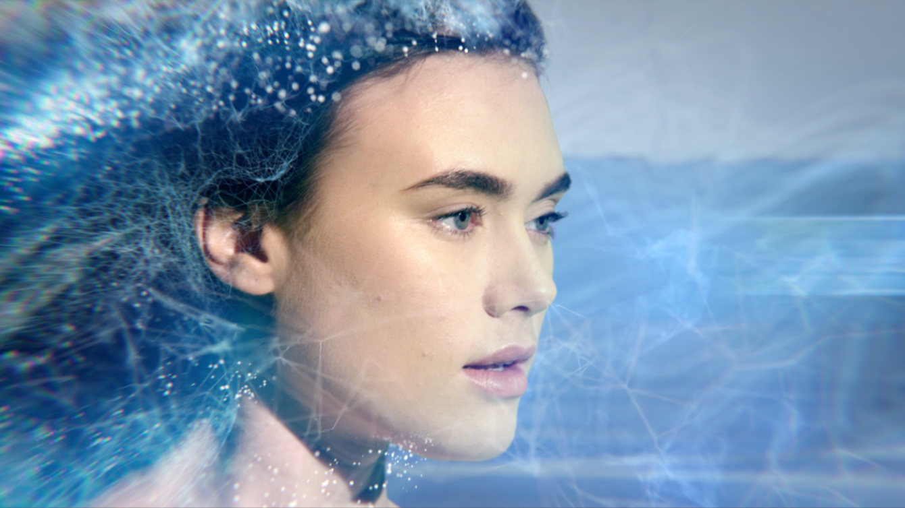
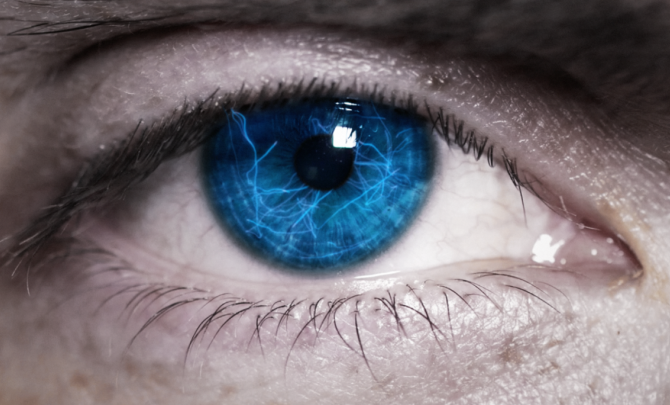
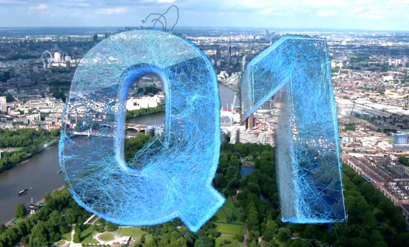
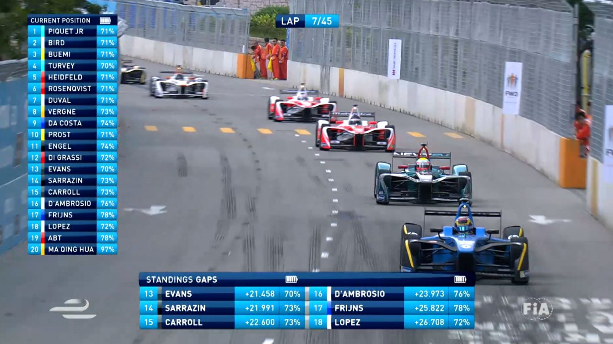
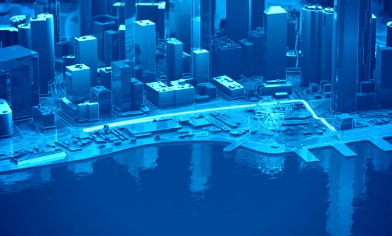
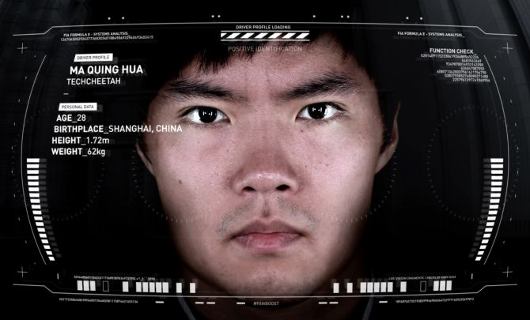
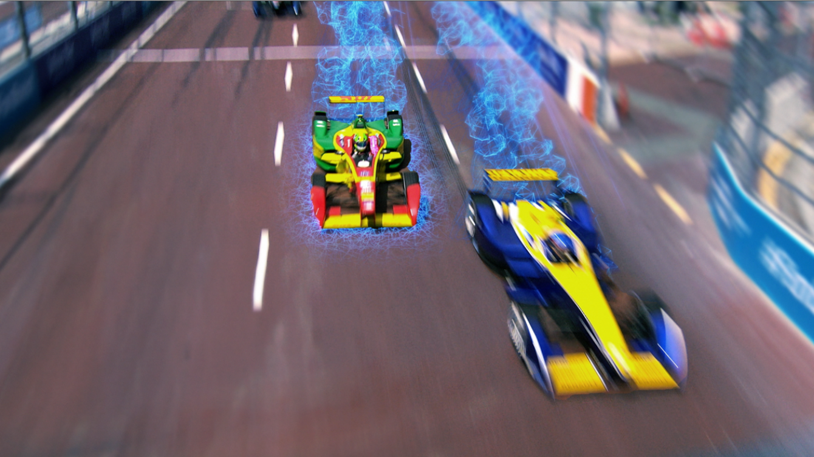

# formula E

- Source URL: https://www.jamesharford.com/formula-e
- Slug: formula-e

**Video (Vimeo):** https://vimeo.com/794878222

## Formula E

**Role/Credit:** FIA Formula E

3D Animation for all broadcast and live in race graphics for Season 3 of Formula E. Working closely with Aurora Media and Formula E, Hello Charlie created a series of graphics for the race itself, from the grid standings, to gap evolutions for each of the racers. Using our ‘synapse’ creative we carried the concept through to the broadcast graphics for the titles, bumpers and wipes.

Credits
Client : Hello Charlie
Role: 3d Animation & Design of packages - Main focus was 3d animation and design for the map scenes and Visual FX

