# JD Reid

- Source URL: https://www.jamesharford.com/jd-reid
- Slug: jd-reid

## JD Reid : Just Know

**Role/Credit:** Design, Direction, Animation

JD Reid hit up Beej & Jeremy Cole to conceive and direct the first Music video from JD Reids new album, Tree.

JD Reid  was happy for us to take our time and not rush something out. This gave us the time to spend a lot more on the concept stage.

The concept for this piece references the gold voyager vinyl that was sent into space. We wanted to send JD reids album into space, with the idea of spreading the music like seeds into the universe, from which beautiful trees grow, deep in the cosmos, waiting to be discovered by future civilisations. The video is one continuous linear camera move through the passage of time.

**Video (Vimeo):** https://vimeo.com/379167102

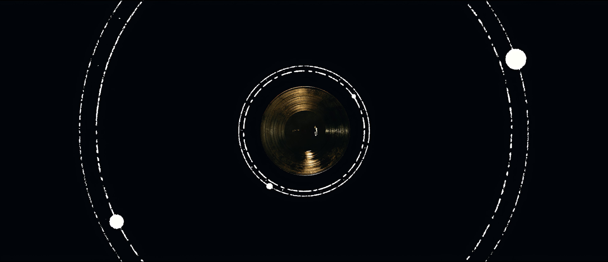

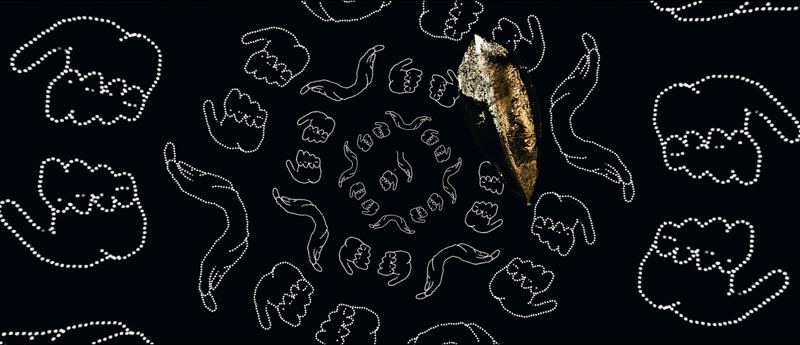

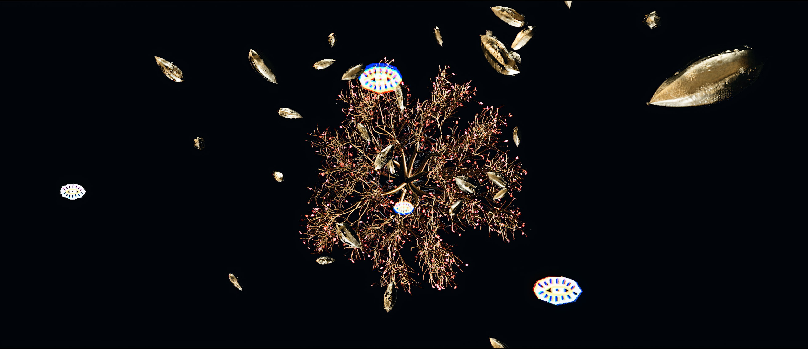

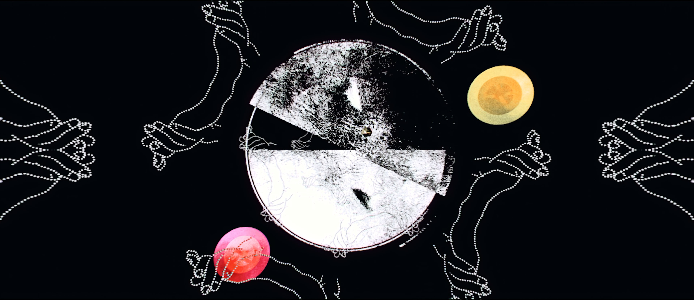

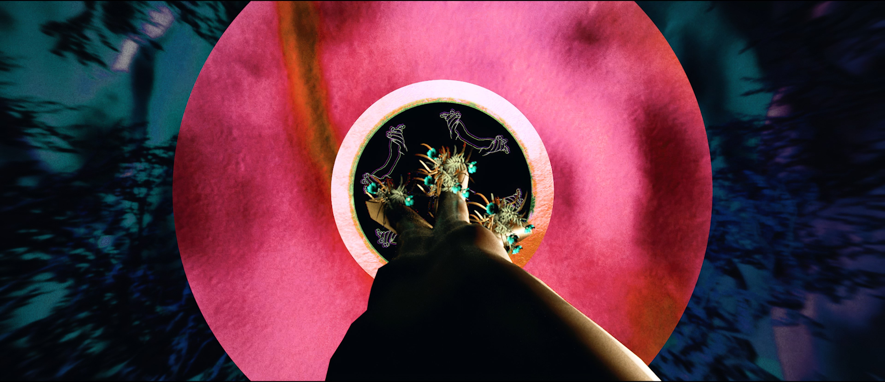

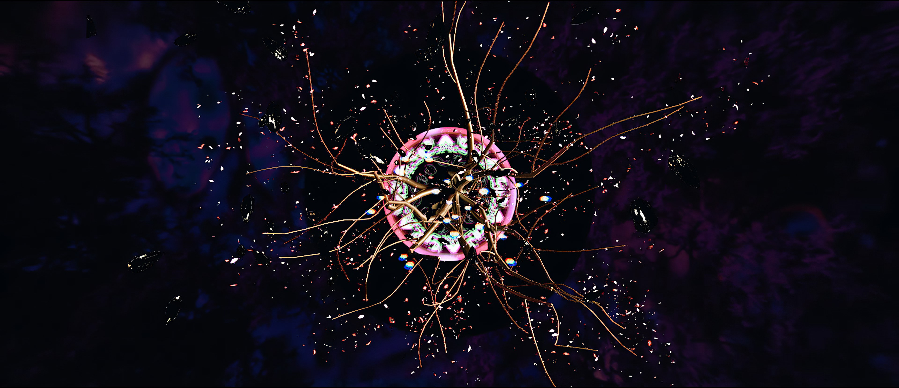

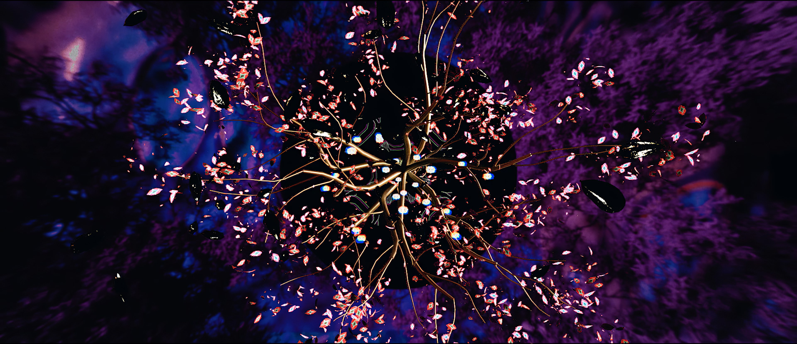

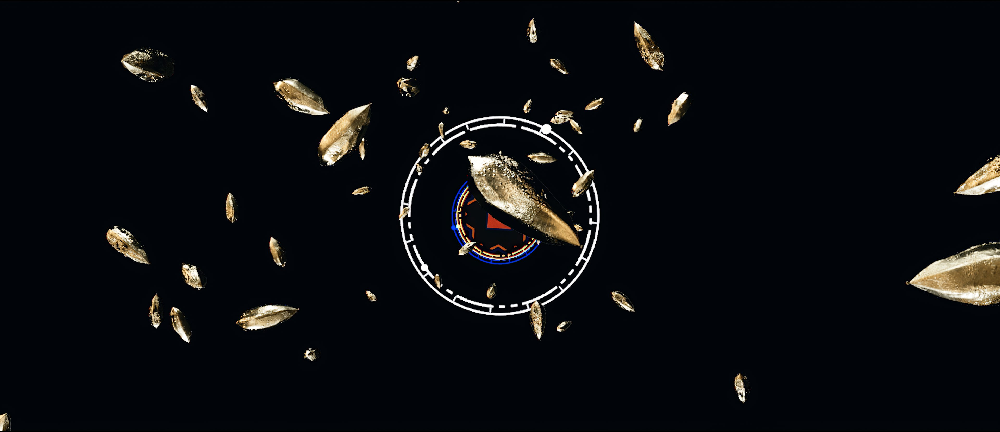

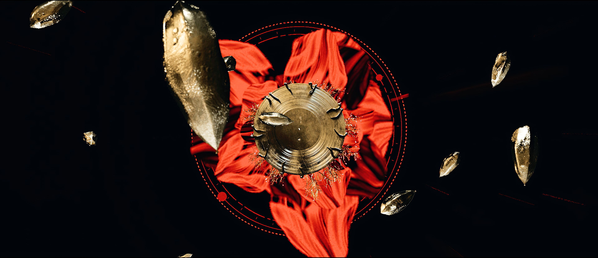

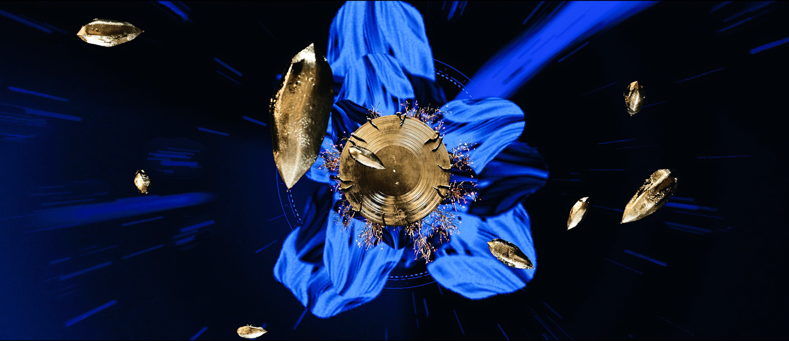

## The Process

**Role/Credit:** -

Early on during the inception stage of the film, we knew we wanted to reference the iconic rad Voyager gold vinyl - but with our own twist.

The Voyager Golden Records are two phonograph records that were included aboard both Voyager spacecraft launched in 1977. The records contain sounds and images selected to portray the diversity of life and culture on Earth, and are intended for any intelligent extraterrestrial life form who may find them.

Voyager 1 will pass within 1.6 light-years' distance of the star Gliese 445, currently in the constellation Camelopardalis, in about 40,000 years.

-

The gold seeds are representative of life continued in music, distributed around the galaxy. Playing into the title of JD's album 'Trees'

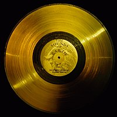

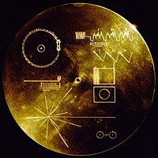

**Video (Vimeo):** https://vimeo.com/379167102

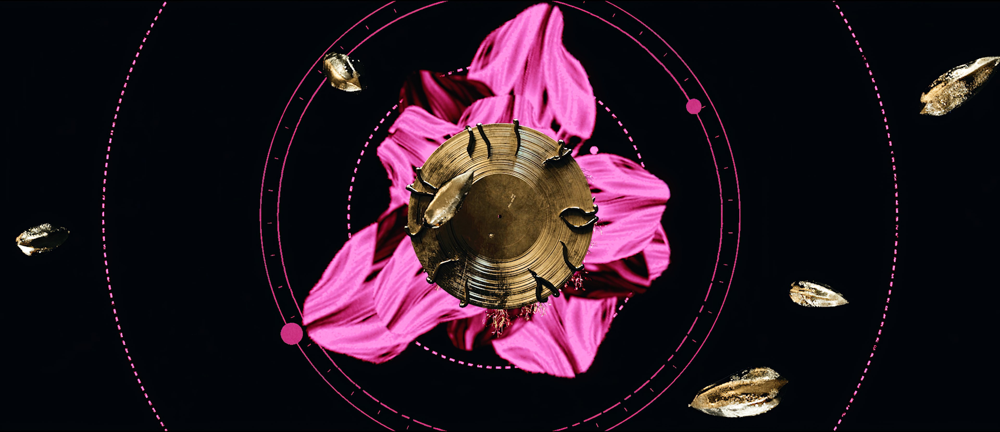

